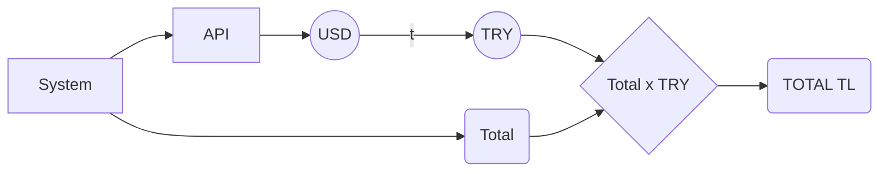

# OEM CALCULATOR

Hi! 
With this calculator, you can calculate the products **automatically**, all you have to do is enter the product **name** and product **price**.

# API

The calculation is done and the total is kept in the background, but for those who want to calculate it **in a different currency**, we pull the exchange rate via an API.
We multiply the incoming data with the total and show it to the user.

To explain visually:

For API: [Documentation](https://www.frankfurter.app/docs/)

## Application Images

  

## THANKS

This content is a post-training study.
Thanks for viewing.
[Linkedin](https://www.linkedin.com/in/fatihgumus59)
